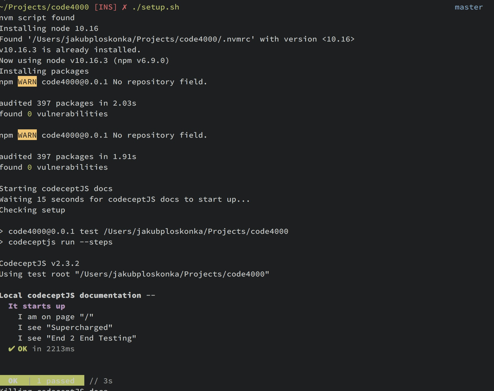

## Setup instructions

Clone the repository

``` sh
$ git clone git@github.com:jploskonka/code4000.git
```

Run the `setup` script
``` sh
$ cd code4000
$ ./setup.sh
```

This will install necessary dependencies (nodejs, codeceptjs, local codeceptjs
documentation) and then run sample codecept test to make sure everything works
as expected. You should see output like this:



Please note that codeceptjs documentation is run on `localhost` at port `3000`
so please make sure that there’s no any other application using it.
