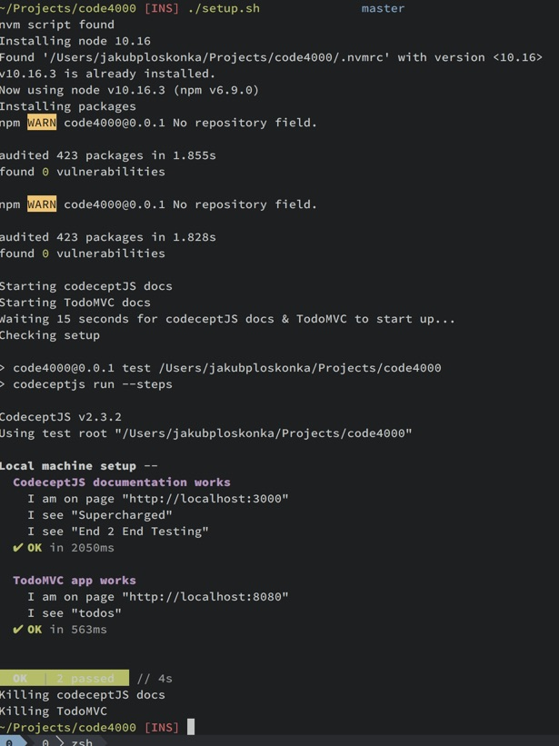

# Testing websites at ease
## 2 days workshops for code4000

## About
We’re gonna spend two days talking and learning about quality in software
development, why it matters and how to make sure our work meets demanded
standards.

We’re gonna start with some theoretical discussion on what quality is, what it
means in different software environments and how to measure something looking so
subjective.

From that we’re take on live coding exercises with CodeceptJS testing framework,
at first working with already existing Todo list application learning basics,
then we’ll take our knowledge to everyone’s own web projects, either already
existing or created from scratch during the workshops.

We’ll wrap our meeting having another discussion on how software development
process looks like in teams, and how companies make sure people work with each
other without (too much) chaos and misunderstandings. We’ll finish our meeting
with Retrospective session, just like we’d do in most of real-world projects.

## Setup instructions

Clone the repository

``` sh
$ git clone git@github.com:jploskonka/code4000.git
```

Run the `setup` script
``` sh
$ cd code4000
$ ./setup.sh
```

This will install necessary dependencies (nodejs, codeceptjs, local codeceptjs
documentation) and then run sample codecept test to make sure everything works
as expected. You should see output like this:



Please note that codeceptjs documentation is run on `localhost` at port `3000`
and todoMVC application on port `8080` so please make sure there’re no other
applications using those ports.
