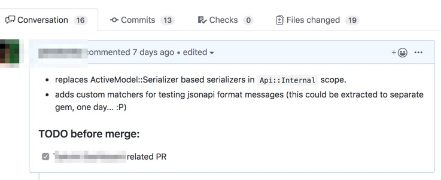
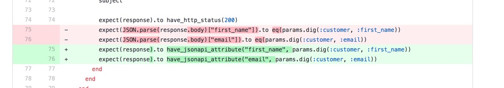
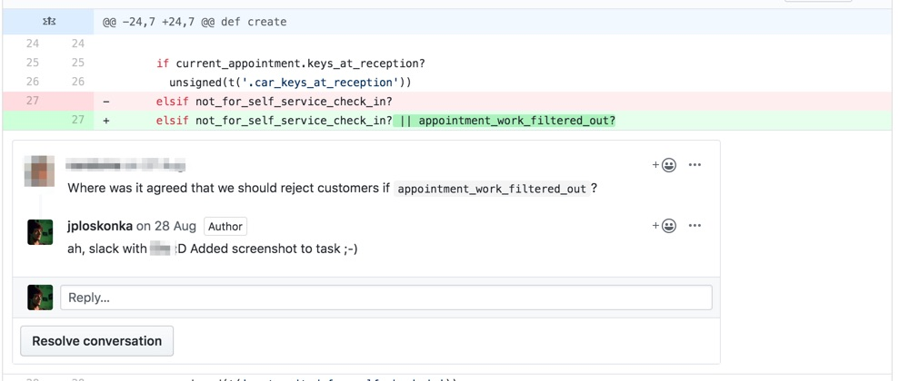
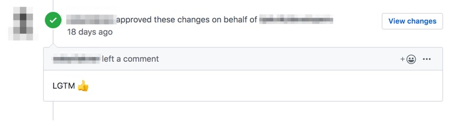
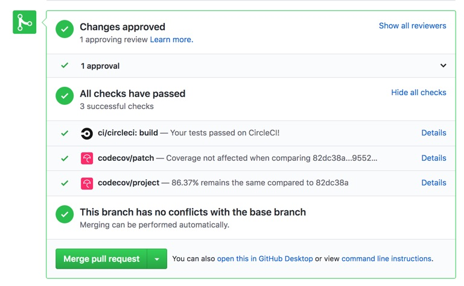

autoscale: true

#[fit] Quality? What?

---

# What quality is?

---

# Multiple definitions exist
- Capability of a software product to conform to business requirements
- Bringing customer value
- Is easy to work with
- Seems everyone has it’s own opinion...

---

# Why measure quality?

---

# Risk management
- Software errors can lead to serious issues
- Aviation, nuclear power stations, hospitals

# Cost management
- Mistakes can lead to money loss
- Banking, finance

---

# CISQ’s quality model

---

# CISQ?
## Consortium for IT Software Quality
- launched in August 2009
- 24 founders
  - Software Engineering Institute at Carnegie Mellon University
  - Object Management Group
- standardising actions for defining, measuring and improving IT software
  quality

---

# Reliability
- likelihood of potential application failures
- defects injected during modifications (stability)
- prevents application downtime, outages, errors affecting users

---

# Efficiency
- how fast software is
- more important in some environments, less in others

---

# Security
- likelihood of potential security breaches damaging the business
- often low because of poor coding standards

---

# Maintainability
- how hard it is to add new features
- notion of adaptability & portability between developers/teams
- critical for applications working under tight time-to-market schedules

---

# Size
- not quality related itself, but usually has big impact on maintainability
- highly depends on technology stack

---

#[fit] Quality in web development

---

# Challenges?

---

# Challenges
- quickly changing & evolving business requirements
- changing team members
- new features coming
- many usage contexts (phones, watches, laptops, fridges)

---

# How to solve them?

---

# Code quality
- code reviews
- static analysis
- pair programming
- automated testing

---

# Product quality
- product reviews
- customer testing
- automated testing

---

# Code review
- Ask someone else to look at your code before getting to production
- Usually done in form of Pull Requests

---

---

# Static analysis
- checking for errors in code with specialised software
- for example:
  - eslint for javascript
  - rubocop for ruby

---

---

# Pair programming
- Let two people work on one thing together
- Helps spread knowledge in team
- Keeps code review short

---

# Product reviews
- Like code review but done with product
- Ask other employee to test what you’ve done

---

# Customer testing
- Ask people to use your product and watch them how they do it
- Can be done without their knowledge
- Many different approaches

---

# Any issues with those?

---

# Manual testing problems
- Assumes there’re more people working on product
- Takes time
- May be expensive to setup
- Often repeats same steps

---

# Automated testing
## Let computer test things for you!

---

# Different levels and ways of testing
- Unit testing
- Performance testing
- Monkey testing
- Feature/acceptance/**end to end testing**
- Integration testing
- Regression testing
- Visual testing
- Snapshot testing
- Load testing
- ... many many more ...

---

# Questions?

---

# What we’ve learned?

---

# Key take outs
- Quality is complex and depends o  context
- There’re efforts to measure and define it
- Code and product quality may be two different things
- Maintaining quality is hard but can be automated
  - With software that also has some quality... ;-)

---

# Let’s write some tests!
